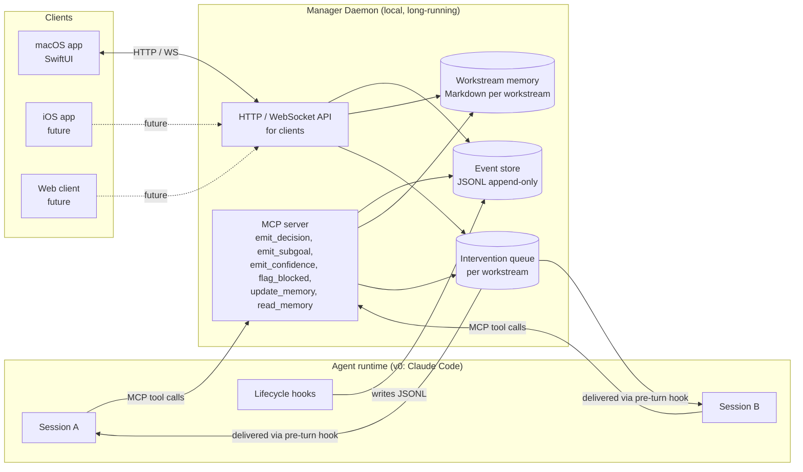
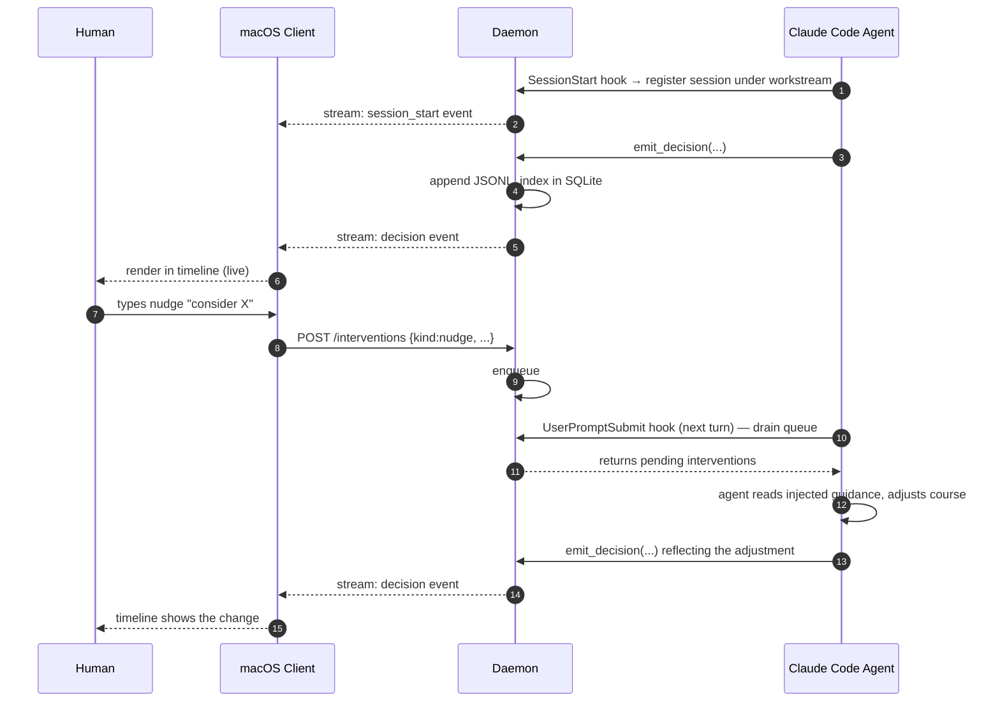
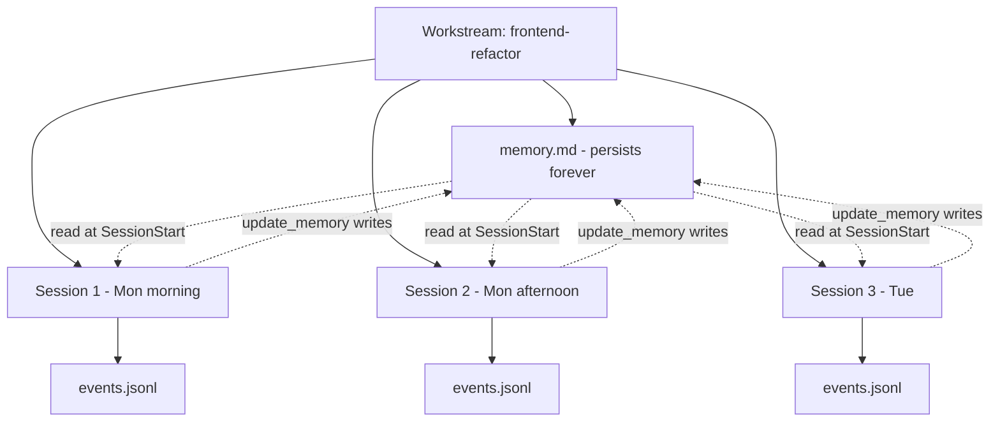
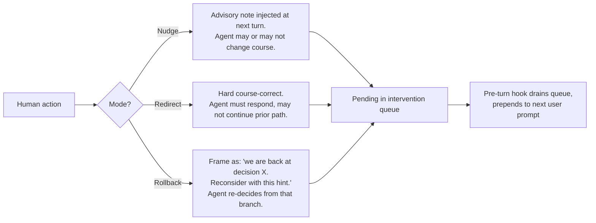

# Architecture

This document describes the components, data flow, and contracts that make Manager work. It is the source of truth for the v0 build.

## Design principles

1. **Tap, not interrupt.** Observation must never block an agent. Agents append to an event log; the manager reads projections of the log. The agent's loop is unaware of who is watching.
2. **Daemon owns state, clients are thin.** All persistent state — events, memory, queues — lives in one local daemon. UI clients (macOS now, iOS / web later) read and write only through the daemon's API. This is what lets us start macOS-native and add a remote/mobile client later without rewriting the brain.
3. **Workstream is the unit of identity, not session.** A workstream (e.g. *frontend-refactor*) spans many Claude Code sessions and carries a Markdown memory file as its accumulating context.
4. **Methodology is structured, not free-form.** Agents emit decision events with rationale and confidence. The UI renders a timeline; the raw transcript is one click away but not the default surface.
5. **Runtime-pluggable from day one.** v0 instruments Claude Code, but the event contract and intervention contract are not Claude-Code-specific. ADK 2.0, marketing pipelines, and other non-coding workflows are future implementations of the same contract.

## System overview



## Components

### Manager Daemon

Long-running local process. The only stateful component. Stack: **TypeScript / Node** — chosen for the official MCP SDK (most mature), cross-platform fit, and fast iteration. Rust remains a future option if footprint becomes a binding constraint.

Responsibilities:

- Host an **MCP server** for agents to call (decision events, memory I/O, blocking flags).
- Host an **HTTP + WebSocket API** for UI clients (subscribe to event stream, read memory, push interventions).
- Own the **event store** — append-only JSONL per workstream, plus a SQLite index when query patterns demand it.
- Own the **workstream memory** — one Markdown file per workstream, owned by the agent (via `update_memory`) and editable by the human.
- Own the **intervention queue** — per-workstream FIFO. Pre-turn hook on the agent side drains it.

State location: `~/.claude/manager/` (events/, memory/, db.sqlite, queues/).

#### HTTP + WebSocket API contract

Localhost-only in v0/v0.5/v1; auth + remote binding land in v1.5. Default port 9876, override via `MANAGER_PORT`. Responses are naked JSON (no envelope wrapping); errors are `{error: string}` with the HTTP status code. All Workstream payloads use the snake_case wire format documented under "Workstream" below.

| Method | Path | Purpose |
|---|---|---|
| `GET` | `/health` | `{ok: true}` — liveness probe used by clients to choose live vs mock. |
| `GET` | `/workstreams` | Array of Workstream wire objects. |
| `POST` | `/workstreams` | Body `{id, title}` → 201 with the new Workstream wire object. |
| `GET` | `/workstreams/:id` | Workstream wire object (with `sessions[]` populated). 404 if unknown. |
| `GET` | `/workstreams/:id/memory` | Raw Markdown body (`text/markdown`). |
| `GET` | `/workstreams/:id/events` | Array of Event JSON objects. Optional `?since=<byteOffset>`. |
| `GET` | `/workstreams/:id/decisions/:decisionId` | Full event envelope of the named `decision` event (`ts`, `workstream_id`, `session_id`, `parent_id`, `payload`). 404 if workstream or decision unknown. |
| `WS`  | `/workstreams/:id/events/stream` | Live event stream. Optional `?since=<byteOffset>` to resume. |
| `POST` | `/hooks/<event>` | Hook intake; `<event>` ∈ {session-start, stop, pre-tool-use, post-tool-use, user-prompt-submit}. |
| `POST` | `/interventions` | Body `{workstream_id, kind, payload}`. Persists into the per-workstream queue. Returns 201 with the persisted Intervention. (Accepts legacy `workstreamId` for one release.) |
| `GET` | `/workstreams/:id/interventions/pending` | Pending interventions (not yet delivered to the agent). |
| `POST` | `/workstreams/:id/interventions/ack` | Body `{ids: string[]}`. Marks delivered, appends `intervention_delivered` events. |

### Agent-side instrumentation (Claude Code, v0)

Two channels feed the daemon:

**Lifecycle hooks** (zero-touch — the agent doesn't know they exist):

| Hook | What it emits |
|---|---|
| `SessionStart` | session attaches to workstream, registers identity |
| `UserPromptSubmit` | drains the intervention queue for this workstream, prepends any nudges/redirects/rollbacks to the next turn |
| `PreToolUse` / `PostToolUse` | tool-call events (low-fidelity activity) |
| `Stop` | session ended, status update |

**MCP tools** (called explicitly by the agent — high-fidelity):

| Tool | Purpose |
|---|---|
| `emit_decision(considered, choice, rationale, confidence, parent_id?)` | structured decision point, the unit the timeline is built from |
| `emit_subgoal(goal, parent_id?)` | push a sub-goal onto the agent's goal stack |
| `emit_confidence(value, note?)` | spot-update confidence outside a decision |
| `flag_blocked(reason)` | escalate — sets the "needs you" flag in the UI |
| `update_memory(section, content)` | write into the workstream memory MD |
| `read_memory(section?)` | read it back |

Agent prompt (system message added at workstream start) instructs the agent to call `emit_decision` at each non-trivial fork and `update_memory` whenever it learns something a future session of this workstream should know.

### Clients

**macOS app (v0):** SwiftUI. Talks to the daemon over `localhost` HTTP/WebSocket. Renders the home view (digest rail, team floor, ticker) and agent detail (timeline, memory pane, intervention controls).

**iOS / web (future):** same API contract, different rendering. The daemon exposes its API on localhost only in v0; v1.5 adds authenticated remote access for mobile.

## Data model

### Workstream

Wire format served by `GET /workstreams` and `GET /workstreams/:id` (snake_case JSON):

```
workstream_id      : string (slug, e.g. "frontend-refactor")
title              : string
created_at         : ISO 8601 timestamp
status             : active | paused | retired
memory_path        : absolute path to ~/.claude/manager/memory/<workstream_id>.md
sessions           : [session_id, ...]   # all Claude Code sessions that ran under this workstream
current_subgoal    : string | null       # head of the goal stack, or null if none
latest_confidence  : number | null       # 0-1, from the most recent decision/confidence event
needs_attention    : boolean             # true after a flag_blocked event until cleared
last_event_at      : ISO 8601 timestamp | null   # most recent activity (cheap mtime approximation in v0)
```

A workstream is the persistent identity. Sessions come and go. The four projection fields drive the home-view cards and are computed as follows:

- `current_subgoal`: head of the goal stack obtained by walking `subgoal_push` / `subgoal_pop` events in chronological order.
- `latest_confidence`: the most recent (by `ts`) numeric confidence from either a `confidence` event (`payload.value`) or a `decision` event (`payload.confidence`).
- `needs_attention`: `true` iff there is a `blocked` event with no later `session_end` for the same `session_id` (a `blocked` event without a `session_id` is resolved by any later `session_end`).
- `last_event_at`: cheap approximation from the JSONL file mtime.

In v0.5.1 these are recomputed by re-reading the per-workstream events file on each `GET /workstreams[/:id]` request — fine for current file sizes; v1 will index them in SQLite and update incrementally on append.

### Event (JSONL line in events store)

```json
{
  "ts": "2026-05-02T22:30:14.123Z",
  "workstream_id": "frontend-refactor",
  "session_id": "01J...",
  "type": "decision",
  "id": "dec_07",
  "parent_id": "dec_05",
  "payload": {
    "considered": ["use react-query", "use SWR", "roll our own"],
    "choice": "use react-query",
    "rationale": "team already has a react-query setup in the API package; SWR adds a dep without payoff",
    "confidence": 0.8
  }
}
```

Event types: `session_start`, `session_end`, `decision`, `subgoal_push`, `subgoal_pop`, `confidence`, `tool_use`, `blocked`, `memory_update`, `intervention_delivered`.

### Workstream memory (Markdown)

Free-form Markdown file the agent maintains. Convention:

```markdown
# Workstream: frontend-refactor

## Goal
Migrate the dashboard package from Redux to react-query.

## Current state
- Phase 2 of 4 — auth queries done, billing queries in progress.

## Key decisions
- 2026-05-02 — chose react-query over SWR (see decision dec_07).

## Open questions
- Whether to keep Redux for offline-cached views or drop it entirely.

## Skills learned
- Pattern for migrating mutation-heavy slices (see decision dec_12).
```

Owned by the agent, edited via `update_memory`. Human can edit directly; next agent session reads the file at `SessionStart` and treats it as ground truth.

### Intervention

```json
{
  "id": "int_42",
  "workstream_id": "frontend-refactor",
  "kind": "nudge | redirect | rollback",
  "payload": {
    "message": "consider whether react-query handles your offline case",
    "rollback_to_decision_id": "dec_05"   // only for kind=rollback
  },
  "created_at": "...",
  "delivered_at": null
}
```

Field names are snake_case on the wire (matching every other endpoint). `delivered_at` stays `null` until the agent's `UserPromptSubmit` hook acks delivery via `POST /workstreams/:id/interventions/ack`. The hook drains in two steps — `GET .../interventions/pending` then `POST .../interventions/ack` — so a transport failure on ack does not lose interventions: they remain pending and re-emit on the next turn. The small accepted risk is duplicate context if the ack fails after the agent has already received the pending list; v1 may add an idempotency token to suppress re-emission. `intervention_delivered` events are appended to the JSONL event store on each successful ack so the methodology timeline shows when the intervention was picked up.

## Event flow: agent emits, manager renders, human nudges



## Workstream model: persistence across sessions



Each session reads the memory file at start, updates it during work, and the next session inherits the latest state. Decision events accumulate across all sessions of the workstream — the timeline is a continuous record, not per-session.

## Intervention semantics



**Rollback is implemented as replay-with-hint, not session-state restoration.** The daemon constructs a message that frames the rollback ("we are returning to decision dec_05; here is what was considered then; here is the new hint") and queues it. The agent treats it as a strong redirect. This keeps v0 simple — no checkpoint or KV-state plumbing. v1+ may add true session-state checkpoints if the replay-with-hint approach proves insufficient.

## Open architectural questions

1. **API auth for remote/mobile**: how clients authenticate when the daemon is exposed beyond localhost. Deferred to v1.5; localhost-only for v0/v0.5/v1.
2. **Multi-machine workstreams**: do workstreams ever span machines (laptop + cloud)? Out of scope for v0; assume single-machine.
3. **Skill broadcast storage**: shared team handbook is one Markdown file vs one file per skill. Decided when v1 begins.
